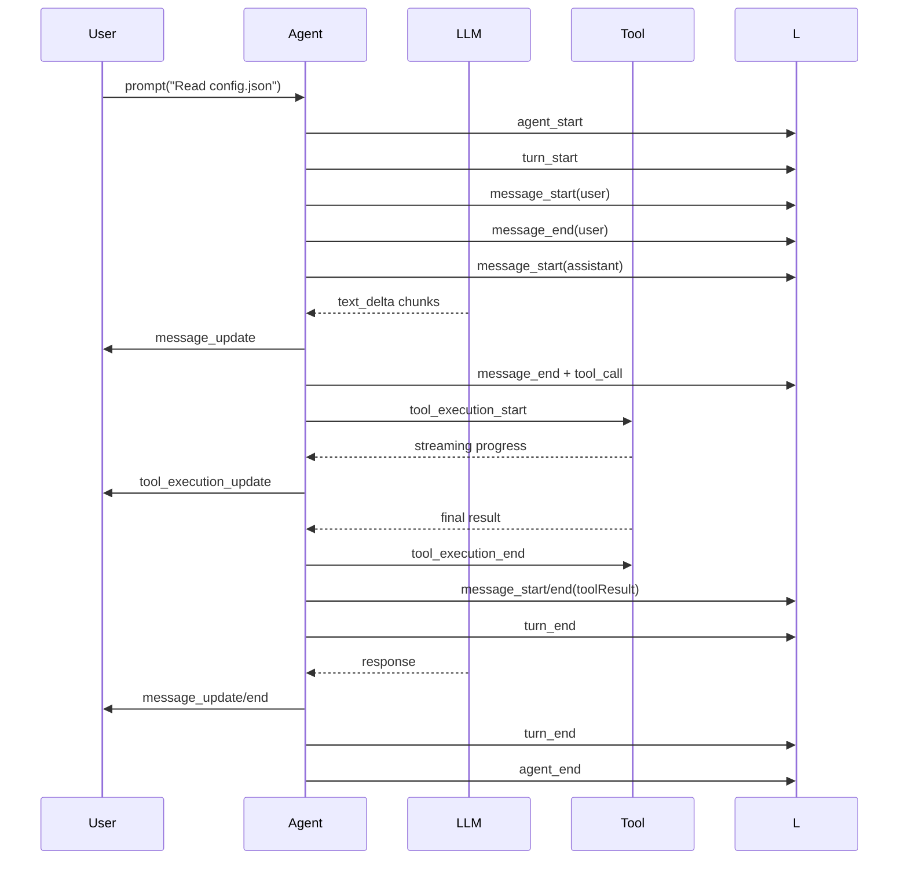

# 1@mariozechner/pi-agent-core 适用性调研

> 仓库：https://github.com/badlogic/pi-mono
> 包名：`@mariozechner/pi-agent-core`（v0.60.0）
> 作者：badlogic（Mario Zechner，libgdx 等开源项目作者）

## 一、概述

`pi-agent-core` 是 `pi-mono` monorepo 中的核心 Agent 包，提供**有状态、带工具执行和事件流式推送**的 AI Agent 框架。基于 `@mariozechner/pi-ai`（统一 LLM API 封装）构建，支持多 provider、多模型、自定义工具、运行时拦截等能力。

### 源码结构

```
packages/agent/src/
├── index.ts       # 统一导出
├── agent.ts      # Agent 类（高级 API）
├── agent-loop.ts # agentLoop / agentLoopContinue（低级 API）
├── proxy.ts      # 浏览器端 Proxy 工具函数
└── types.ts      # 类型定义
```

## 二、核心能力

### 2.1 有状态 Agent（高级 API）

```typescript
import { Agent } from "@mariozechner/pi-agent-core";
import { getModel } from "@mariozechner/pi-ai";

const agent = new Agent({
  initialState: {
    systemPrompt: "You are a helpful assistant.",
    model: getModel("anthropic", "claude-sonnet-4-20250514"),
  },
});

agent.subscribe((event) => {
  if (event.type === "message_update" && event.assistantMessageEvent.type === "text_delta") {
    process.stdout.write(event.assistantMessageEvent.delta);
  }
});

await agent.prompt("Hello!");
```

### 2.2 工具系统（AgentTool）

使用 TypeBox 定义参数 schema：

```typescript
import { Type } from "@sinclair/typebox";

const readFileTool: AgentTool = {
  name: "read_file",
  label: "Read File",
  description: "Read a file's contents",
  parameters: Type.Object({
    path: Type.String({ description: "File path" }),
  }),
  execute: async (toolCallId, params, signal, onUpdate) => {
    const content = await fs.readFile(params.path, "utf-8");
    return {
      content: [{ type: "text", text: content }],
      details: { path: params.path, size: content.length },
    };
  },
};

agent.setTools([readFileTool]);
```

### 2.3 事件流（Event Streaming）



**核心事件类型**：

| 事件 | 说明 |
|---|---|
| `agent_start` / `agent_end` | Agent 整体生命周期 |
| `turn_start` / `turn_end` | 单轮 LLM 调用 + 工具执行 |
| `message_start` / `message_update` / `message_end` | 消息生命周期（含流式 delta） |
| `tool_execution_start` / `tool_execution_update` / `tool_execution_end` | 工具执行生命周期 |

### 2.4 Steering 和 Follow-up（运行时干预）

在工具执行期间，外部可以注入干预消息：

```typescript
// 工具运行中：注入转向消息
agent.steer({
  role: "user",
  content: "Stop! Do this instead.",
  timestamp: Date.now(),
});

// Agent 完成后：注入后续消息
agent.followUp({
  role: "user",
  content: "Also summarize the result.",
  timestamp: Date.now(),
});
```

Steering 消息在当前 turn 工具全部执行完毕后注入；Follow-up 消息在无工具调用且无 steering 时检查并注入。

### 2.5 工具执行钩子（beforeToolCall / afterToolCall）

```typescript
const agent = new Agent({
  beforeToolCall: async ({ toolCall, args, context }) => {
    if (toolCall.name === "bash") {
      return { block: true, reason: "bash is disabled" };
    }
  },
  afterToolCall: async ({ toolCall, result, isError, context }) => {
    if (!isError) {
      return { details: { ...result.details, audited: true } };
    }
  },
});
```

### 2.6 低级 API（agentLoop / agentLoopContinue）

不依赖 Agent 类的底层异步生成器 API，支持更细粒度的控制：

```typescript
import { agentLoop, agentLoopContinue } from "@mariozechner/pi-agent-core";

const context: AgentContext = {
  systemPrompt: "You are helpful.",
  messages: [],
  tools: [],
};

const config: AgentLoopConfig = {
  model: getModel("openai", "gpt-4o"),
  convertToLlm: (msgs) => msgs.filter(...),
  toolExecution: "parallel",
};

for await (const event of agentLoop([userMessage], context, config)) {
  console.log(event.type);
}

// 继续从当前上下文执行
for await (const event of agentLoopContinue(context, config)) {
  console.log(event.type);
}
```

## 三、架构特点

### 3.1 消息模型分离

- `AgentMessage`：Agent 层使用的灵活消息类型，支持自定义类型通过声明合并扩展
- `Message`（LLM Message）：LLM provider 理解的标准格式（user/assistant/toolResult）

转换链路：`AgentMessage[] → transformContext() → AgentMessage[] → convertToLlm() → Message[]`

### 3.2 上下文管理

- `transformContext`：在发送给 LLM 前对消息进行修剪、注入外部上下文、压缩等
- 消息持久化在 `AgentState.messages` 中，可通过 `replaceMessages` / `appendMessage` / `clearMessages` 管理
- 支持 `continue()` 从当前上下文继续（last message 必须是 user 或 toolResult）

### 3.3 并发模式

- `toolExecution: "parallel"`（默认）：预检工具调用按顺序执行，允许的工具并发执行
- `toolExecution: "sequential"`：工具按顺序逐个执行

### 3.4 依赖

**无外部依赖**（`dependencies: {}`）。核心逻辑完全自包含，依赖 `pi-ai` 的部分在 pi-mono workspace 内部处理。

## 四、与现有方案的对比

| 维度 | pi-agent-core | LangChain.js | Vercel AI SDK |
|---|---|---|---|
| 状态管理 | 内置有状态 Agent | 可选 Memory | 可选状态 |
| 工具定义 | TypeBox schema | Zod / JSON Schema | Zod / TypeBox |
| 事件流 | 结构化事件（含 delta） | Callback / AsyncIterator | Streaming text |
| 工具并发 | 支持 parallel/sequential | 支持 | 支持 |
| 工具拦截 | beforeToolCall / afterToolCall | 工具钩子 | Middleware |
| 依赖大小 | 轻量（0 外部依赖） | 较重 | 中等 |
| Provider 抽象 | 依赖 pi-ai（内部） | 多 provider | 多 provider |
| 适用场景 | 私有 monorepo 内使用 | 通用场景 | 通用场景 |

## 五、适用性分析

### 5.1 适合的场景

- **私有 Agent 应用**：如果 divisor-agent 需要构建自己的 AI Agent 能力（不只是调用 LLM，而是有工具执行、状态管理、流式 UI 的 Agent），`pi-agent-core` 提供开箱即用的完整框架
- **TypeScript monorepo**：包本身是 TypeScript，无外部依赖，体积小，适合嵌入现有 monorepo
- **需要精细化工具控制**：beforeToolCall/afterToolCall 提供了比大多数方案更灵活的权限拦截能力
- **需要 Steering/Follow-up**：在工具执行期间允许外部干预，这种能力在通用方案中较为少见

### 5.2 不适合的场景

- **需要完整生态**（向量存储、RAG、复杂 Chain 等）：`pi-agent-core` 只提供 Agent 核心层，不包含 LangChain 那样的丰富生态
- **多语言支持**：纯 TypeScript，无其他语言 SDK
- **需要生产级支持**：非商业项目，无企业级 SLA
- **轻量嵌入**：如果只是需要一个简单的 LLM 调用封装，`pi-agent-core` 过于重量级

### 5.3 对 divisor-agent 的参考价值

即使不直接采用 `pi-agent-core`，其设计思路有参考价值：

1. **事件流设计**：通过结构化事件（而非裸文本流）驱动 UI 更新，与 divisor-agent 的前端架构（React）契合
2. **工具定义模式**：TypeBox schema + execute 函数 + 拦截钩子的模式可借鉴
3. **有状态管理**：`transformContext` + 消息压缩的设计思路对长对话管理有参考意义
4. **Steering 机制**：运行时干预的机制可用于实现 Agent 的动态控制

## 六、关键文件索引

| 文件 | 职责 |
|---|---|
| `src/agent.ts` | `Agent` 类，事件订阅，状态管理 |
| `src/agent-loop.ts` | `agentLoop` / `agentLoopContinue` 底层 API |
| `src/proxy.ts` | 浏览器端流式代理工具 |
| `src/types.ts` | 所有类型定义（AgentTool, AgentMessage, Events 等） |

## 七、总结

`pi-agent-core` 是一个设计精良的**轻量级有状态 Agent 框架**，核心优势在于：
- 零外部依赖、代码简洁易维护
- 完整的事件流系统
- 灵活的工具拦截与运行时干预能力

对于 divisor-agent，如果后续演进方向是构建 AI Coding Agent（而非简单的 REST API 调用），`pi-agent-core` 或借鉴其架构是值得考虑的方向。若仅需 LLM 调用能力，则当前方案（直接使用 Claude API SDK）已足够。
