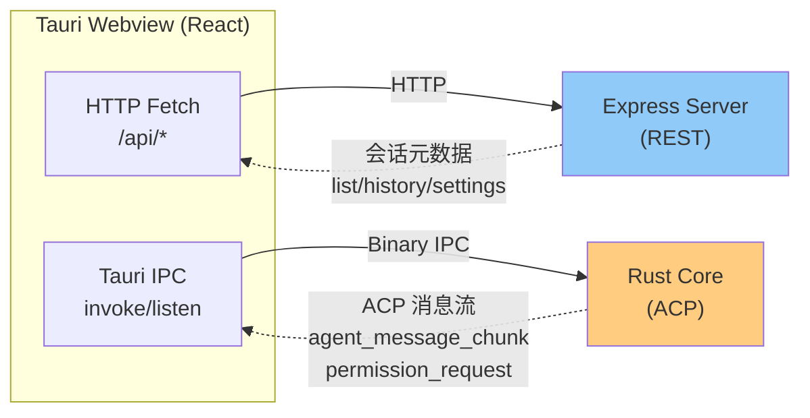
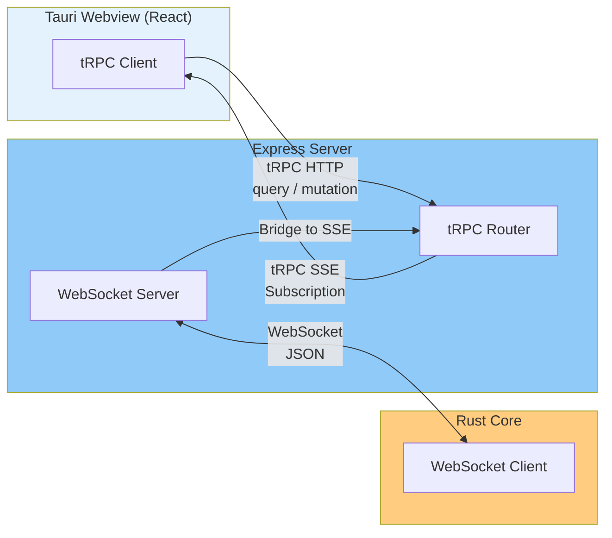
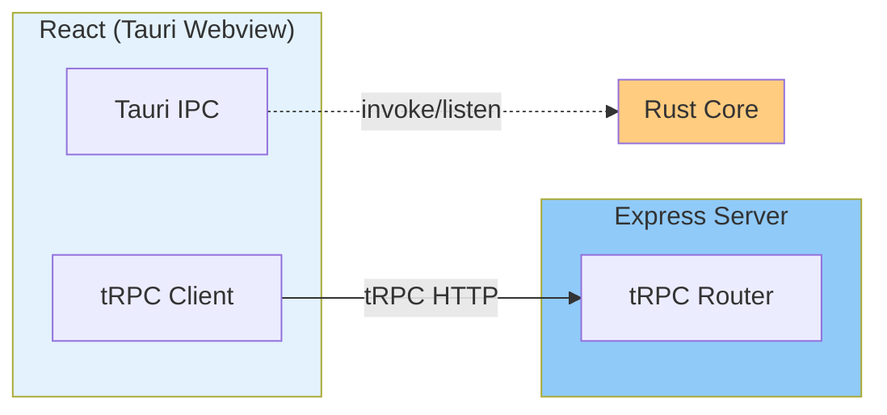
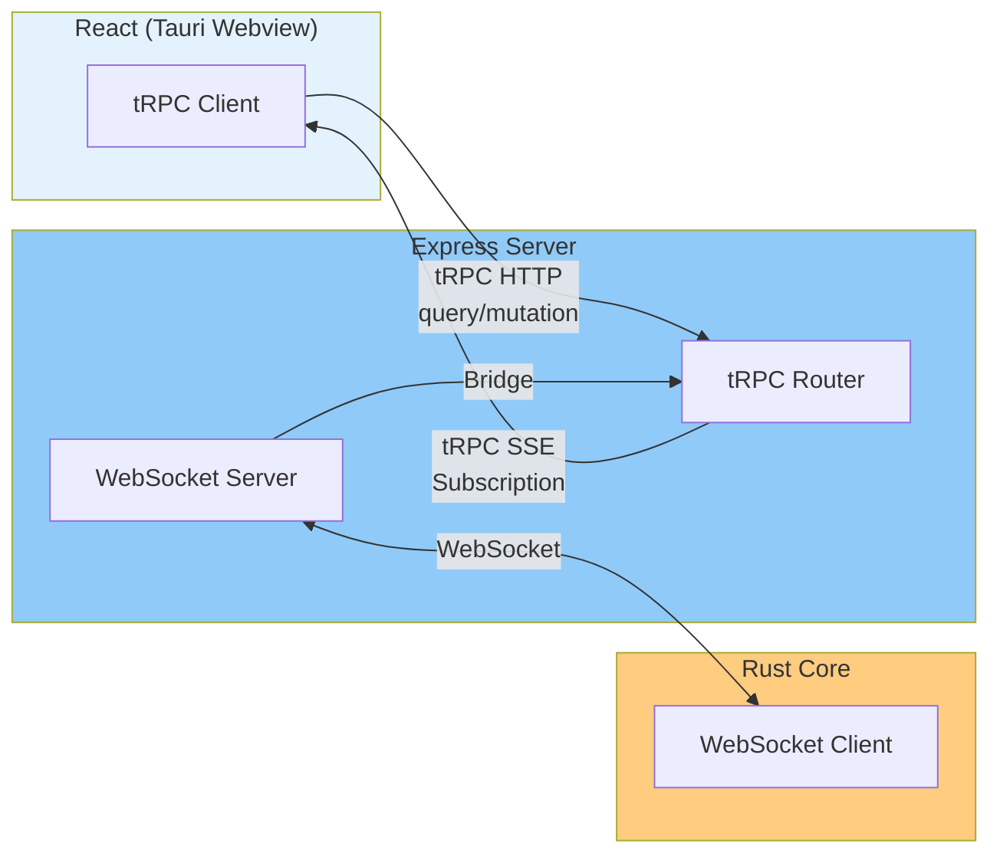

# 1tRPC 在 divisor-agent 项目中的适用性调研

## 一、项目当前架构



**两层通信职责**：

| 通道           | 技术                          | 职责                                   |
| -------------- | ----------------------------- | -------------------------------------- |
| 前端 ↔ Express | HTTP REST (`/api/*`)          | 会话元数据（列表、历史消息、设置）     |
| 前端 ↔ Rust    | Tauri IPC (`invoke`/`listen`) | ACP 连接、终端执行、文件操作、流式消息 |

当前 Express Server 仅有一个 health-check 路由，业务路由（`/api/sessions` 等）尚未实现。

---

## 二、tRPC 简介

tRPC 是一种 TypeScript-first 的 RPC 框架，特点：

- 端到端类型安全，前后端共享 TypeScript 类型，无需手写 API schema
- 零配置，通过过程（procedure）定义 API
- 支持查询（query）、变更（mutation）、订阅（subscription/SSE）
- 自动生成 API 文档和类型客户端

---

## 三、tRPC 在当前架构中的适用性分析

### 3.1 Express ↔ React 层（可替换）

**现状**：前端文档中定义了 5 个 REST 接口（`GET /api/sessions`、`GET /api/sessions/:id/history` 等）。

**tRPC 能带来的收益**：

- 前后端共享同一个 TypeScript 类型定义，修改接口时类型错误直接报错
- 去掉 Zod validation + REST 路由的重复工作
- 更好的开发时补全和类型提示

**实施方式**：

```ts
// server/src/routers/sessions.ts
const sessionsRouter = router({
  list: publicProcedure.query(async () => {
    /* ... */
  }),
  history: publicProcedure
    .input(z.object({ id: z.string(), cursor: z.string().optional() }))
    .query(async ({ input }) => {
      /* ... */
    }),
  rename: publicProcedure
    .input(z.object({ id: z.string(), name: z.string() }))
    .mutation(async ({ input }) => {
      /* ... */
    }),
  delete: publicProcedure.input(z.object({ id: z.string() })).mutation(async ({ input }) => {
    /* ... */
  }),
});

// client/src/api/sessions.ts
const sessions = api.routers.sessions;
const sessionList = await sessions.list(); // 完全类型安全
```

**结论：✅ 推荐在此层使用 tRPC**，投入产出比高。

---

### 3.2 Rust ↔ Express WebSocket 通道（可新增）

**完全可行。** Rust 作为 WebSocket 客户端连接 Express Server，建立 ACP 通信通道，与 tRPC 并存。

**架构示意**：



**通道职责分工**：

| 通道                  | 方向            | 协议          | 职责                                 |
| --------------------- | --------------- | ------------- | ------------------------------------ |
| tRPC (query/mutation) | React → Express | HTTP          | 会话元数据的读写（列表、历史、设置） |
| tRPC Subscription     | Express → React | SSE           | 将 Rust 推送的事件转发给 React       |
| WebSocket             | Rust → Express  | TCP/WebSocket | Rust 主动向 Express 推送 ACP 事件    |

**为什么可行**：

- WebSocket 客户端可以是任何语言，Rust 有成熟的 `tokio-tungstenite` 库
- Express 通过 `ws` 或 `socket.io` 可以轻松承载 WebSocket 服务端
- tRPC 的 subscription endpoint 本身支持 SSE，可以作为前端订阅入口
- Rust 通过 WebSocket 发消息到 Express，Express 通过 tRPC SSE 推给前端——全链路打通

**数据流示例（审批请求）**：

```
1. Rust 检测到高风险操作
2. Rust → Express (WebSocket): { type: 'permission_request', requestId, operation, params }
3. Express → React (tRPC Subscription via SSE): 同上
4. React 用户点击「批准」
5. React → Express (tRPC mutation): permission_approve
6. Express → Rust (WebSocket): { type: 'permission_approve', requestId }
7. Rust 继续执行
```

**技术选型**：

- Rust 端：`tokio-tungstenite` + `futures-util`
- Express 端：`ws`（轻量）或 `socket.io`（带 rooms/namespace，适合多会话场景）
- 消息格式：JSON，与 ACP 协议解耦

**结论：✅ 可行，且架构清晰。** Rust 接入 Express 不影响 tRPC 层的独立性，两套通道互不干扰。

---

### 3.3 Tauri IPC 是否可以移除？

引入 Rust → Express WebSocket 通道后，Rust 与前端的通信从 Tauri IPC 迁移到了 Express 中转。此时 Tauri IPC 的必要性取决于前端是否需要**直接**调用 Rust。

**需要保留 Tauri IPC 的场景**：

- 前端需要直接触发 Rust 命令（如 `session_prompt`、`session_fork`），不经过 Express
- 出于安全考虑，不想让 Express 有权限触发 Rust 的敏感操作

**可以移除 Tauri IPC 的场景**：

- 所有 Rust 命令都通过 Express 中转（前端 → tRPC mutation → Express → WebSocket → Rust）
- Express 作为唯一的命令入口，Rust 不接受前端直接 IPC 调用

**建议**：初期保留 Tauri IPC 作为快速路径，同时搭建 WebSocket 通道。后续根据安全需求决定是否统一到 Express 中转。

---

## 四、tRPC 集成方案设计

### 4.1 架构变化

**方案 A（保守）— tRPC + 保留 Tauri IPC**：



**方案 B（激进）— tRPC + Rust WebSocket 通道**：



- tRPC 替换所有 REST API
- Rust 通过 WebSocket 主动推送 ACP 事件给 Express
- Express 通过 tRPC Subscription (SSE) 转发给前端
- Tauri IPC 可逐步废弃

### 4.2 依赖引入

```ts
// server/package.json 需新增
{
  "@trpc/server": "^11",
  "superjson"         // 支持 Date/Map 等类型的序列化
}

// client/package.json 需新增
{
  "@trpc/client": "^11",
  "@trpc/react-query": "^11",
  "@tanstack/react-query": "^5"
}
```

**注意**：tRPC 依赖 React Query，需要在客户端引入 `QueryClientProvider`。

### 4.3 tRPC Router 设计

| Procedure          | Type     | Input             | Description        |
| ------------------ | -------- | ----------------- | ------------------ |
| `sessions.list`    | query    | -                 | 获取会话树         |
| `sessions.history` | query    | `{ id, cursor? }` | 分页获取会话历史   |
| `sessions.rename`  | mutation | `{ id, name }`    | 重命名会话         |
| `sessions.delete`  | mutation | `{ id }`          | 删除会话           |
| `settings.get`     | query    | -                 | 获取应用与模型配置 |

### 4.4 与现有设计的兼容性

- ✅ 会话数据结构不变（`SessionNode`、`Message` 类型不变）
- ✅ 分页逻辑不变（cursor-based pagination）
- ✅ 错误处理方式可复用（Zod validation 在 tRPC input 层处理）
- ⚠️ React 端需引入 `QueryClientProvider`（如果尚未使用 React Query）

---

## 五、结论

| 评估维度                 | 结论                                                                |
| ------------------------ | ------------------------------------------------------------------- |
| Express ↔ React 层       | ✅ **推荐使用 tRPC** — 端到端类型安全，DX 好，替换成本低            |
| Rust ↔ Express WebSocket | ✅ **可行** — Rust 作为 WebSocket 客户端连接 Express，技术成熟      |
| Rust Tauri IPC           | ⚠️ **可选** — 若采用 WebSocket 通道，Tauri IPC 可逐步废弃；否则保留 |
| 整体收益                 | **正向** — tRPC + WebSocket 双通道架构清晰，各自职责明确            |
| 实施风险                 | **低** — 渐进式迁移，可先引入 tRPC，再搭建 WebSocket 通道           |

**最终建议**：

1. **短期**：Express ↔ React 层引入 tRPC，Rust 通信保持 Tauri IPC
2. **长期**：Rust 通过 WebSocket 连接 Express，Express 通过 tRPC Subscription 转发事件给前端，Tauri IPC 可废弃

两条通道完全可以并存，架构灵活性高。

---

## 六、后续步骤

### 阶段一：引入 tRPC（低风险）

1. 在 server 安装 `@trpc/server`、`superjson`
2. 在 app 安装 `@trpc/client`、`@trpc/react-query`、`@tanstack/react-query`
3. 创建 `server/src/trpc.ts`（tRPC 实例和中间件）
4. 创建 `server/src/routers/`（按域拆分 router）
5. 在 `app.ts` 中挂载 tRPC middleware
6. 创建 `client/src/lib/trpc.ts`（tRPC client 实例）
7. 在 `App.tsx` 外层包 `QueryClientProvider` + `trpc.Provider`
8. 将现有 HTTP Fetch 调用替换为 tRPC procedure 调用

### 阶段二：搭建 Rust → Express WebSocket 通道（可选）

1. 在 server 安装 `ws`（`npm i ws`）
2. 在 Express 创建 WebSocket Server（与 HTTP server 共用同一端口或单独端口）
3. 在 Rust 安装 `tokio-tungstenite`，实现 WebSocket 客户端连接
4. 定义 WebSocket 消息协议（JSON 格式）
5. 将 Rust 中现有的 `emit` 事件改为发送 WebSocket 消息
6. 在 Express 中实现 WebSocket → tRPC Subscription 的桥接
7. 前端订阅 tRPC Subscription，接收 ACP 事件
8. （可选）废弃 Tauri IPC 事件监听，改为 tRPC Subscription
